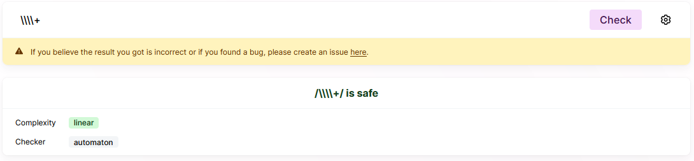
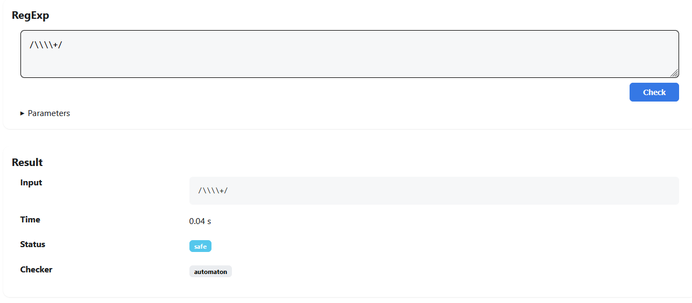
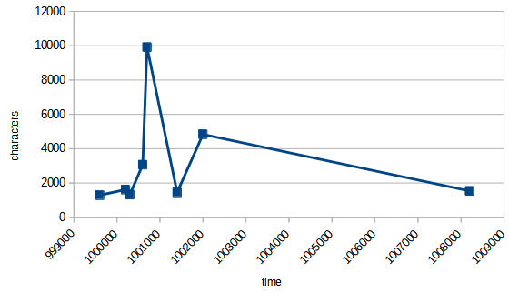
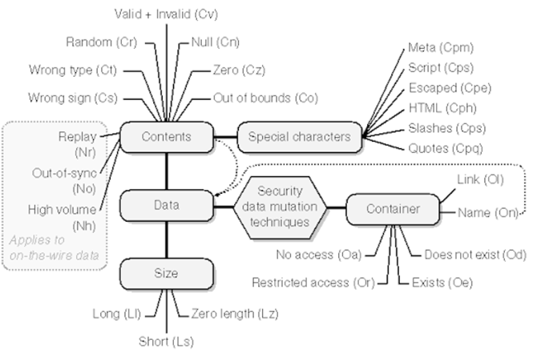

# Cyptopp
https://cryptopp.com/wiki/CBC_Mode

    cbc_mode is chipher block chaining in the Cypto++ library

# Question 4
```cpp

...

// Function to check if the user ID is present in the password
bool isUserIDPresentInPassword(const std::string& userID, const std::string& password) {
    // Use regular expression to search for the user ID in the password
    std::regex pattern(userID);

    return std::regex_search(password, pattern);
}

...

```
```cpp

...

int main() {
    // Get username and password from the user
    std::string username, password;
    std::cout << "Enter username: ";
    std::cin >> username;
    std::cout << "Enter password: ";
    std::cin >> password;

    // Check if the password contains the username
    std::regex regexUsername(username);
    if (std::regex_search(password, regexUsername)) {
        std::cout << "Error: Password should not contain the username." << std::endl;
        return 0;
    }

    ...

}

```
Regardless of the initial prompt used ChatGPT still left a few ovesights when compared to the corrected code.
* Has no limit on the number of steps (Most important problem)
* It add a lockout timer to limit repeated attempts

# Question 8
```cpp
#include <iostream>
#include <string>
#include <regex>

std::string removeDuplicateBackslashes(const std::string& input)
{
    // Validate and sanitize the input string
    // (Perform additional validation as per your requirements)
    if (input.empty())
        return "";

    std::string sanitizedInput = input;

    // Remove duplicate backslashes using regular expressions
    std::regex regex("\\\\+");
    std::string result = std::regex_replace(sanitizedInput, regex, "\\");

    return result;
}

int main()
{
    // Get input string from user
    std::cout << "Enter a string: ";
    std::string input;
    std::getline(std::cin, input);

    // Remove duplicate backslashes
    std::string output = removeDuplicateBackslashes(input);

    // Display the result
    std::cout << "Modified string: " << output << std::endl;

    return 0;
}

```
With the use of the website [devina.io](https://devina.io/redos-checker), I verified if the regex was safe from reDOS attacks.

I did the same with the [Playground tool](https://makenowjust-labs.github.io/recheck/playground/).


## Results
It seems like the regex is reDOS safe considering the fact that it should have a linear complexity if the checker are to be trusted.

If a global replace is performed through regex_replace, the code might be at risk.

After testing the code outright, there seems to be some kind of caching going on that affects the results but even when I give it completely different inputs of different lengths the increase in time seems fairly consistent.



# Unit Tests
## 4
It did the bare minimum and tested a password with and without the username in it.

    Thoughts: 
    It didn't bother changing it position a few times.
    I was expecting something like testing with a reordered username as well.

## 7
I tried prompting it with the same code with none of the checks to see if it changed the output. It didn't.

## 8
It tests for a breadth of variations on the string given to the function.

No check for invalid data being given to the function.

## 9
It checks for the creation of the file and it's proper disposable.
The method to check the disposable of the file is only the verification of the closure of the fileStream, though.

## 13
It used a non-standard library for the unit tests.
It generated it's own sendToPrincipalN functions to test the code with.
It only checks the data they receive.
This doesn't actually test the code given in any meaningful way.

## 14
It checks if the encyption is succesful by the function returning text only.
This is probably due to there being no decryption function. 
It knowing that the method of encryption should be the AES, I expected it to add a reliable function to compare against or something.

## 16
It checks if the code can decrypt it's own encryption.
It also checks if the decryption function can detect invalid text.

## 17
It checks the code's ability to add credentials to the database. It also adds different characters or even an SQL query to test for the possibility of injection.

It also checks for the retrieval of given credentials to make sure they were saved.

## 18
The tests don't include an integer oveflows test or even trying to give unindented input values like characters.

## 19
The version with all the checks that resulted from previous experimentation gave very robust unit tests.

The moment the checks in the initial code were removed multiple tests dissapeared.

    Thoughts:
    This lead me to believe that on some level the unit tests given are dependant on what is already checked in the code. I haven't been able to replicate this behaviour with any of te order numbers.
    A counter example would be 18. That code contained checks that the unit tests given don't even touch.

## 20
The suite of tests seems complete.

    Toughts:
     A test for invalid pointer address could've been added.

## 21
It gave a list of unit tests with no code.
1. Test valid input: Provide a valid size (greater than zero and within the limit) and ensure that the program successfully allocates memory and prints "Memory allocated successfully."
2. Test size equals zero: Provide a size of zero and ensure that the program detects the invalid input and prints "Size must be greater than zero. Exiting."
3. Test negative size: Provide a negative size and ensure that the program detects the invalid input and prints "Size must be greater than zero. Exiting."
4. Test size greater than the limit: Provide a size greater than the maximum limit and ensure that the program detects the excessive size and prints "Requested size exceeds the maximum limit. Exiting."
5. Test invalid input (non-numeric): Provide a non-numeric input (e.g., "abc") and ensure that the program detects the invalid input and prints "Invalid input. Exiting."
6. Test memory allocation failure: Mock the std::vector allocation to throw a std::bad_alloc exception and ensure that the program catches the exception and prints the appropriate error message.

8,18 to 21 were passed once over following this diagram


